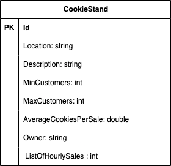

# Cookie Stand API

The Cookie Stand API is a RESTful web service that allows you to manage and retrieve information about cookie stands in various locations.

This documentation provides an overview of the available endpoints and how to use them.





## Endpoints


### Create a Cookie Stand

- **Endpoint:** `POST /cookiestand`
- **Description:** Create a new cookie stand with the specified details.
- **Request Body:**
  ```json
  {
    "location": "Barcelona",
    "description": "A cozy cookie stand in the heart of Barcelona.",
    "minimum_customers_per_hour": 3,
    "maximum_customers_per_hour": 7,
    "average_cookies_per_sale": 2.5,
    "owner": "John Doe"
  }
  ```
- **Response:** Returns the created cookie stand with a unique ID.
  
### List All Cookie Stands

- **Endpoint:** `GET /cookiestands`
- **Description:** Retrieve a list of all cookie stands.
- **Response:** Returns a JSON array of cookie stand objects, each with its details.

### Get a Cookie Stand

- **Endpoint:** `GET /cookiestand/{id}`
- **Description:** Retrieve details of a specific cookie stand by its ID.
- **Response:** Returns a JSON object with the cookie stand's details.

### Update a Cookie Stand

- **Endpoint:** `PUT /cookiestand/{id}`
- **Description:** Update the details of a specific cookie stand by its ID.
- **Request Body:** Include the updated attributes of the cookie stand.
- **Response:** Returns the updated cookie stand object.

### Delete a Cookie Stand

- **Endpoint:** `DELETE /cookiestand/{id}`
- **Description:** Delete a cookie stand by its ID.
- **Response:** Returns no content.

